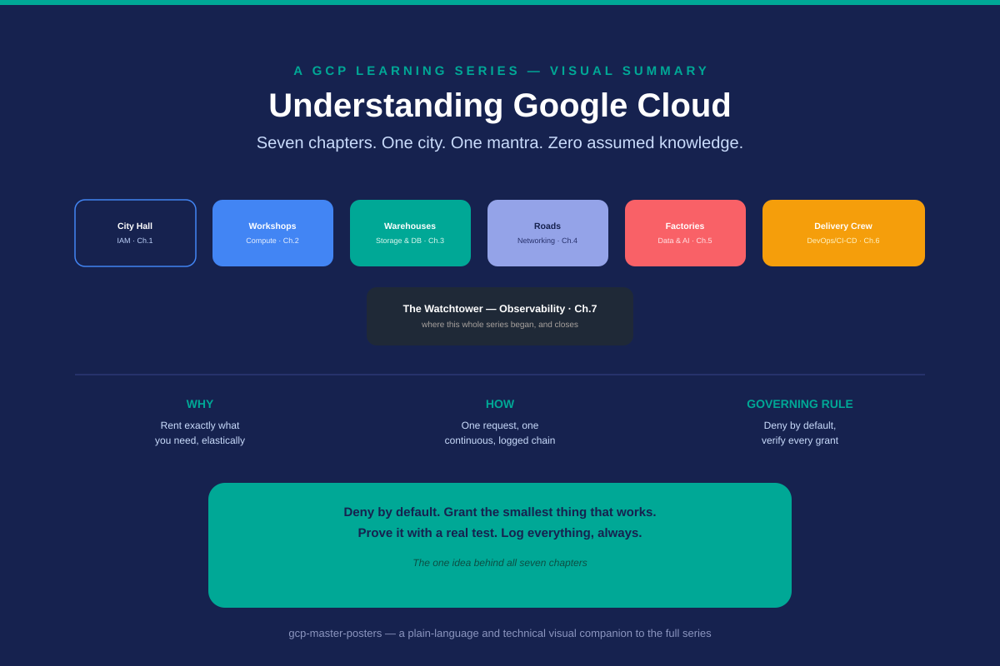
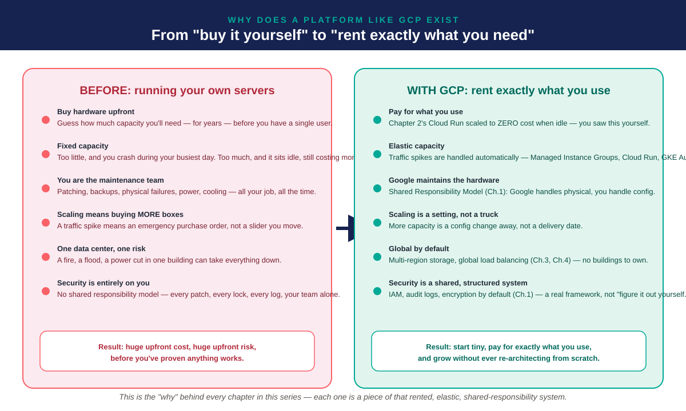
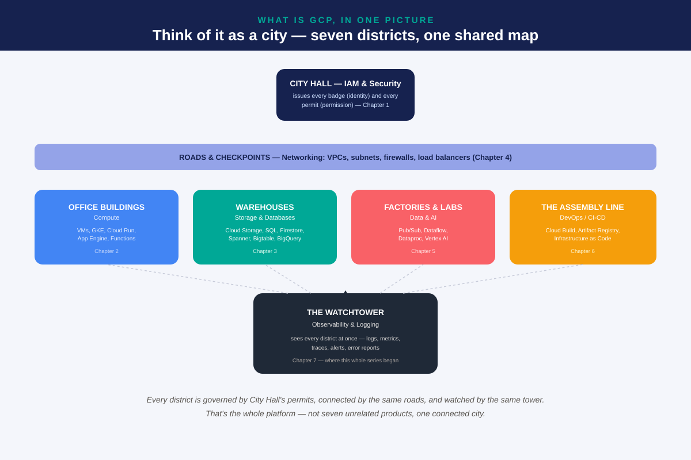
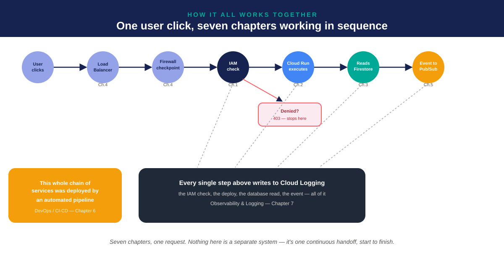
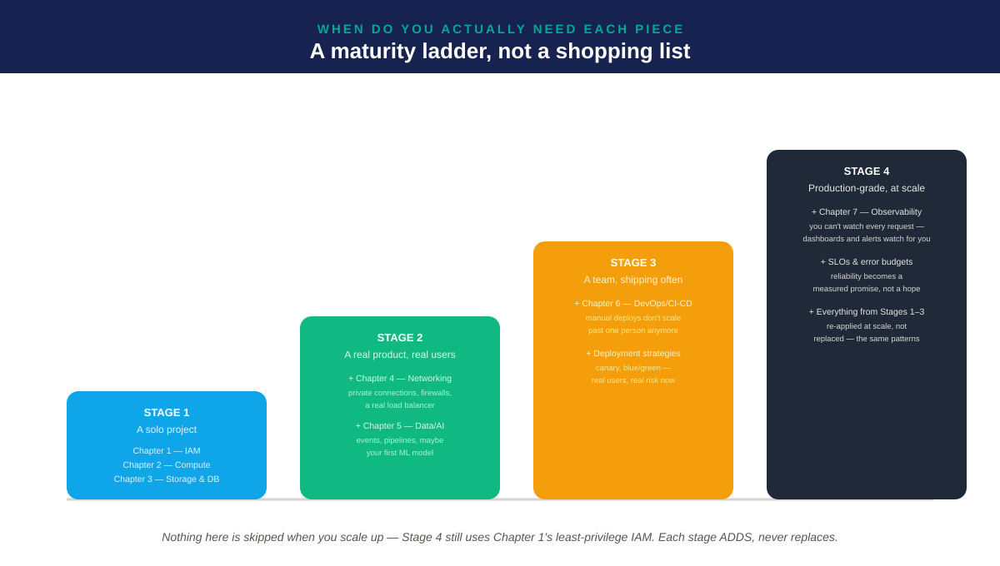
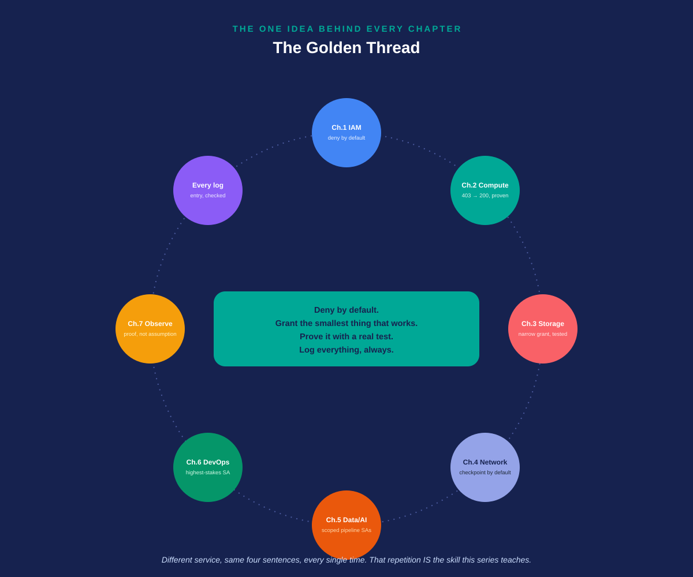
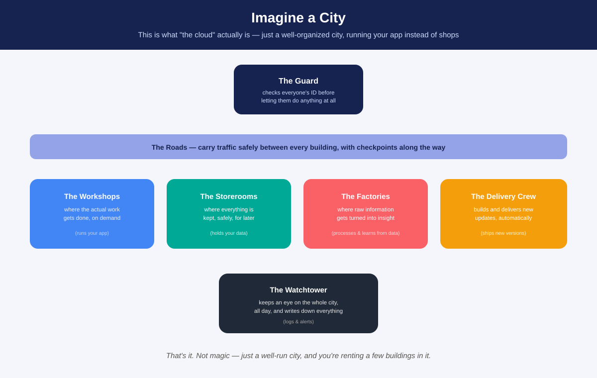
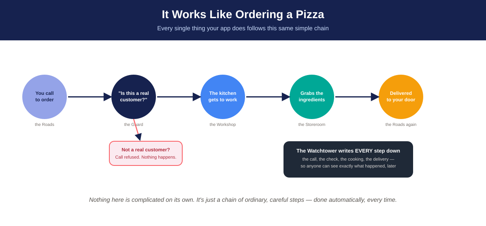
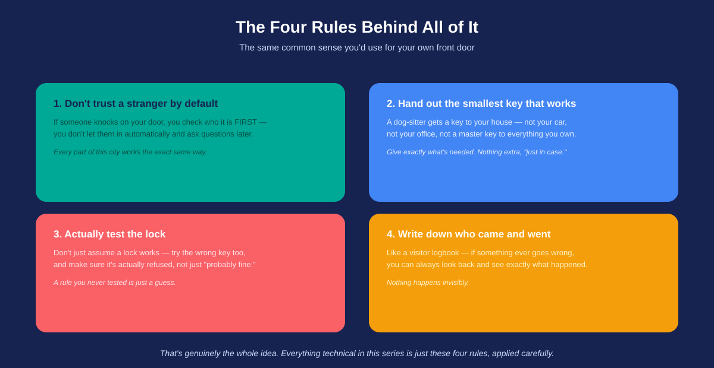

# Understanding Google Cloud
### A Visual Companion — Nine Posters, Two Reading Levels, One Governing Idea



---

## Abstract

This repository is a self-contained visual explanation of Google Cloud Platform, distilled from a seven-chapter, hands-on learning series into nine standalone posters. It exists to answer four questions — **why**, **what**, **how**, and **when** — plus one underlying question that turns out to matter more than any of the four: **what single idea makes all of this trustworthy?**

Every poster stands on its own. Every claim in this document is traceable back to a real, verified result from the source series — a denied request, a granted request, and an audit log entry, repeated across seven different GCP services. Nothing here is theoretical; it is a synthesis of work actually performed, screenshots actually captured, and mistakes actually made and corrected along the way.

Two audiences are served by two parallel tracks. The `simple/` track uses no technical vocabulary at all — a city, a phone call for a pizza, and the common sense of a household front door are the only prior knowledge required. The technical track, at the repository root, uses the real vocabulary of the platform and maps directly onto the seven chapters of the underlying series. A full translation table late in this document allows a reader to move fluidly between the two.

---

## 📖 Contents
1. [Section I — The Problem: Why a Platform Like This Exists](#section-i--the-problem-why-a-platform-like-this-exists)
2. [Section II — The Architecture: What the Platform Is Made Of](#section-ii--the-architecture-what-the-platform-is-made-of)
3. [Section III — The Mechanics: How a Single Request Actually Moves](#section-iii--the-mechanics-how-a-single-request-actually-moves)
4. [Section IV — The Adoption Curve: When Each Capability Earns Its Place](#section-iv--the-adoption-curve-when-each-capability-earns-its-place)
5. [Section V — The Governing Principle: The Idea Underneath Everything](#section-v--the-governing-principle-the-idea-underneath-everything)
6. [Section VI — The Plain-Language Companion](#section-vi--the-plain-language-companion)
7. [Appendix A — Translation Table](#appendix-a--translation-table)
8. [Appendix B — Repository Structure](#appendix-b--repository-structure)
9. [Appendix C — Frequently Asked Questions](#appendix-c--frequently-asked-questions)
10. [Appendix D — Glossary](#appendix-d--glossary)
11. [Methodology and Provenance](#methodology-and-provenance)

---

## Section I — The Problem: Why a Platform Like This Exists



Before any service, any diagram, or any acronym is worth learning, a more basic question deserves an honest answer: what problem is actually being solved here? The temptation, faced with a platform as large as Google Cloud, is to begin cataloguing services — compute, storage, networking — as though the platform's existence were self-evident. It is not. Every one of those services is an answer to a specific, avoidable cost that organizations used to pay simply to keep a computer running.

Poster 1 lays this out as a direct comparison, six rows deep, read straight across. On the left: the accumulated friction of owning infrastructure outright — capital spent before a single customer exists, capacity sized by guesswork, a single building's failure capable of taking an entire operation offline, and a security posture that rests entirely on one team's diligence, with no structural backstop. On the right, row by row, the same six problems answered — not through some abstract "cloud magic," but through a specific, teachable pattern: **elastic capacity**, **shared responsibility**, and **global infrastructure rented, never owned**.

This is not a marketing claim. It is a direct restatement of what was demonstrated firsthand in the second chapter of the underlying series, where a deployed compute service scaled itself down to zero running instances — and zero cost — during idle periods, then scaled back up on the next request, entirely automatically. That single observed behavior is the concrete, load-bearing proof underneath the abstract phrase "pay for what you use."

The bottom band of the poster distills this into two sentences worth remembering: self-hosting asks for **upfront cost and upfront risk before anything is proven to work**; the rented model asks instead for **evidence of demand before further investment**. Every chapter that follows this one is, in effect, one more mechanism for making that second sentence actually true in practice — not just true in principle.

---

## Section II — The Architecture: What the Platform Is Made Of



Having established why a platform of this kind is worth using, the next honest question is what, precisely, it consists of. Google Cloud is frequently described as a catalogue of dozens of individual products — a description that is accurate and almost useless, because it gives a newcomer no way to know which five or six of those dozens actually matter for a first understanding.

Poster 2 answers this by collapsing the platform into seven functional districts, arranged as a single connected city rather than an unordered product list — deliberately mirroring the same structure used in the plain-language companion (Section VI), because the underlying shape of the idea does not change based on the reader's technical background, only its vocabulary does.

**City Hall**, at the top of the composition, represents Identity and Access Management — the system that determines, for every single action anywhere in the city, whether the requester is who they claim to be and whether they are permitted to do the specific thing they are attempting. Nothing else in the diagram can act without first passing through this layer, which is why it is drawn alone, above every district it governs.

**The Roads**, spanning the full width of the poster beneath City Hall, represent the platform's networking layer — Virtual Private Clouds, subnets, firewall rules, and load balancers. This layer is drawn as a single continuous band, not a district of its own, because its defining property is connective: no other district reaches any other district without passing across it.

Four districts sit below the roads, each a specific category of work: **Office Buildings** (compute — virtual machines, containers, and serverless platforms where code actually executes), **Warehouses** (storage and databases — six distinct engines, each suited to a different shape of data, as detailed in the source series' third chapter), **Factories & Labs** (data processing and machine learning pipelines), and **the Assembly Line** (the automated build-and-deploy tooling that turns source code into a running service without manual intervention).

Beneath all of it sits **the Watchtower** — observability and logging — connected by dashed lines to every district above it, drawn last and on top of the rest of the composition specifically to reinforce that observability is not one more silo alongside the others, but a lens laid across the entire structure simultaneously.

---

## Section III — The Mechanics: How a Single Request Actually Moves



Architecture answers what exists; it does not, by itself, explain how any of it behaves under a real, live request. Poster 3 closes that gap by tracing one concrete action — a user's click — through every layer described in Section II, in the literal order those layers are actually encountered.

The chain begins at a **Load Balancer**, which routes incoming traffic toward the nearest healthy backend, then passes through a **Firewall checkpoint**, which enforces network-level rules before the request is permitted to reach any application logic at all. Only after clearing both does the request reach an **IAM check** — the moment identity and permission are actually evaluated. This ordering is not arbitrary: it reflects the genuine, layered sequence of a real GCP request, where network-level and identity-level enforcement are distinct, sequential gates rather than a single combined check.

A denial at the IAM gate is illustrated as a short branch rather than folded silently into the main chain, for a specific reason: a permission denial in a correctly designed system is not a failure state to be minimized or hidden — it is the system working exactly as intended, and it deserves equal visual weight to success. The request that clears IAM continues onward to **Cloud Run**, where application logic executes; to **Firestore**, where persistent data is read; and finally to **Pub/Sub**, where the completed action may itself become an event triggering further downstream processing.

Two elements are layered beneath the main chain, and both are intentional departures from a simple left-to-right flow. The first is the observation, made explicit through dashed connecting lines, that every meaningful action in the chain — the IAM decision, the compute execution, the database read, the published event — writes independently to Cloud Logging. This is not a single logging step appended at the end of the chain; it is a property of each individual step, occurring continuously and in parallel with the main flow, which is precisely why Chapter 1 of the source series was able to observe a fully populated audit trail after performing exactly this kind of sequence by hand. The second element, positioned deliberately apart from the request chain itself, is a reminder that the entire chain shown was not assembled by hand in production — it was deployed by an automated pipeline, the subject of Section IV's third stage and the source series' sixth chapter.

---

## Section IV — The Adoption Curve: When Each Capability Earns Its Place



A common and reasonable objection to a seven-chapter platform is that no single project needs all seven chapters on day one — and this objection is correct. Poster 4 addresses it directly, reframing the platform not as a fixed checklist but as a maturity curve, where each capability becomes necessary at a specific, identifiable stage of growth rather than being required uniformly from the start.

The visual language is deliberately a staircase, not a row of equal boxes: each stage is drawn taller and further along than the one before it, because each stage genuinely contains everything from the stage before — nothing already adopted is ever discarded as a project matures. A solo project at **Stage 1** reasonably requires only identity, compute, and storage — the minimum triad needed to build and secure anything at all. A product that has found real users at **Stage 2** now has a case for deliberate network design and a first data pipeline, because uncontrolled network exposure and manual data handling both begin to carry real cost only once real traffic exists. A team shipping code regularly at **Stage 3** has crossed the threshold where manual deployment stops scaling and begins actively introducing risk — the point at which automated, tested deployment pipelines stop being a convenience and start being a requirement. And a system operating at **Stage 4**, production-grade and at scale, has reached the point where a human can no longer personally watch every request — the point at which structured observability, service-level objectives, and error budgets shift from optional refinement to operational necessity.

The single sentence beneath the staircase is the entire argument in miniature: adoption is additive, never a replacement. A Stage 4 system still relies on the identical least-privilege IAM discipline established at Stage 1 — it simply applies that same discipline at a scale where it can no longer be verified by hand.

---

## Section V — The Governing Principle: The Idea Underneath Everything



Four preceding sections have described seven chapters as though they were seven separate bodies of knowledge, connected mainly by the fact that they belong to the same platform. Poster 5 makes the case that this framing understates what actually holds the series together: underneath the differing terminology of IAM, compute, storage, networking, data pipelines, deployment automation, and observability sits one repeated discipline, applied with only cosmetic variation from chapter to chapter.

That discipline is stated plainly at the center of the composition, in four sentences: **deny by default; grant the smallest thing that works; prove it with a real test; log everything, always.** The eight nodes arranged in a perfect ring around that center are not illustrative flourishes — they are a claim that every one of the seven chapters, plus the practice of logging itself, independently instantiates all four sentences. Chapter 1 denies IAM access by default and requires an explicit, narrow grant. Chapter 2 denies public access to a deployed service by default and requires an explicit invoker role. Chapter 3 denies database access by default and requires an explicit, if imperfectly scoped, role grant — a limitation the source series treats not as a failure of the pattern but as a genuine, useful boundary worth understanding on its own terms. The pattern repeats through networking's default-deny firewall posture, through the deliberately narrow service accounts recommended for data pipelines and deployment automation, and closes with observability itself, which exists specifically to make the third and fourth sentences — proof and logging — possible at every other layer.

The eighth node, labeled simply "every log entry, checked," is included as a peer to the seven chapter nodes rather than subsumed into Chapter 7's node alone, because logging is not merely a topic Chapter 7 covers — it is a behavior every other chapter continuously exhibits, and the ring's symmetry is meant to make that fact visually unmistakable.

---

## Section VI — The Plain-Language Companion

The technical vocabulary used in Sections I through V — IAM, Cloud Run, Firestore, VPCs, Pub/Sub — is necessary for anyone working directly with the platform, but it is not necessary for understanding the underlying *shape* of the ideas. The three posters below tell the identical story using no technical vocabulary at all, and are provided as a complete, self-sufficient companion for a non-technical reader.



Poster A restates Section II's seven-district architecture using only the concept of a well-run city: a Guard who checks identity before anything happens, Roads connecting every building, Workshops where work is done, Storerooms where things are kept, Factories that turn raw material into insight, a Delivery Crew that ships updates automatically, and a Watchtower that observes the whole city continuously.



Poster B restates Section III's request-flow chain using the universally familiar structure of a phone order: a call is placed, a verification check occurs before anything further happens, the work is performed, materials are retrieved, and the result is delivered — with every step recorded regardless of outcome.



Poster C restates Section V's governing principle using the ordinary judgment already exercised at a household's front door: caution toward strangers by default, access limited to only what a given task requires, a rule considered untrustworthy until it has actually been tested, and a standing record of who came and went.

---

## Appendix A — Translation Table

| Plain-language term | Technical term | Chapter |
|---|---|---|
| The Guard | Identity and Access Management (IAM) | 1 |
| The Workshops | Compute (VMs, Cloud Run, GKE, App Engine, Functions) | 2 |
| The Storerooms | Storage & Databases | 3 |
| The Roads | Networking (VPC, subnets, firewalls, load balancers) | 4 |
| The Factories | Data & AI (Pub/Sub, Dataflow, Dataproc, Vertex AI) | 5 |
| The Delivery Crew | DevOps / CI-CD | 6 |
| The Watchtower | Observability & Logging | 7 |
| "Is this a real customer?" | IAM permission evaluation | 1 |
| "Call refused. Nothing happens." | 403 Forbidden / Access Denied | 1, 2 |
| "Every step written down" | Cloud Audit Logs | 1, 7 |
| Rule 1 — Don't trust a stranger | Deny-by-default access control | All |
| Rule 2 — Smallest key that works | Least-privilege IAM roles | 1 |
| Rule 3 — Actually test the lock | Verification via real denied/allowed requests | 1, 2, 3 |
| Rule 4 — Write down who came and went | Cloud Audit Logs / structured observability | 7 |

---

## Appendix B — Repository Structure

```
gcp-master-posters/
├── README.md                        (this document)
├── 00-cover.svg
├── 01-why-gcp-exists.svg
├── 02-what-is-gcp-city-map.svg
├── 03-how-a-request-flows.svg
├── 04-when-a-maturity-ladder.svg
├── 05-the-golden-thread.svg
└── simple/
    ├── A-the-city.svg
    ├── B-ordering-a-pizza.svg
    └── C-four-rules.svg
```

---

## Appendix C — Frequently Asked Questions

**Is the plain-language track a simplified or approximate version of the technical track?**
No. Every element in the plain-language track corresponds to a specific, real element in the technical track, as documented in Appendix A. The two tracks differ in vocabulary, not in underlying structure or accuracy.

**Why do different posters use different visual structures — a chain, a ring, a staircase?**
The visual structure is chosen to match the logical structure of the idea being shown. A chain (Posters 3 and B) represents a strict sequence. A ring (Poster 5) represents several equally-weighted, order-independent truths. A staircase (Poster 4) represents accumulation over time.

**Can any single poster be understood without the others?**
Yes. Each poster was designed to be complete on its own; this document's sectioning exists to add depth and cross-reference, not to supply context a given poster otherwise lacks.

**What is the relationship between this repository and the source series?**
This repository is a distillation. The source series (linked below) contains the full theoretical treatment of each chapter plus, for the first three chapters, hands-on projects with real, screenshot-verified results. This repository summarizes the conclusions of that work visually; it does not replace the underlying detail.

---

## Appendix D — Glossary

- **IAM (Identity and Access Management)** — the system governing who may perform which action, on which resource.
- **Compute** — infrastructure on which application code executes.
- **Storage / Database** — any system for persisting data, in one of several structural forms.
- **Networking** — the layer governing whether and how traffic is permitted to move between systems.
- **Data pipeline** — an automated sequence of steps that moves and transforms data.
- **CI/CD pipeline** — an automated sequence of steps that builds, tests, and deploys code.
- **Observability** — the set of tools and practices that make a running system's internal state knowable from the outside.
- **Least privilege** — the practice of granting the minimum access sufficient for a given task.
- **Audit log** — a permanent, timestamped, attributable record of an action taken within a system.

---

## Methodology and Provenance

Every claim of fact in this document traces back to a hands-on result produced in the source learning series: service accounts created with zero starting permissions; access denials produced and observed as literal `403` and `PERMISSION_DENIED` responses; access grants subsequently verified to work; and each of these events independently confirmed present in Cloud Audit Logs. Where this document describes platform behavior (such as Cloud Run's scale-to-zero behavior, or Firestore's database-wide IAM scope), that behavior was directly observed during the series rather than assumed from documentation alone.

---

*Part of a self-directed GCP learning series. The full technical treatment of each chapter, including hands-on projects and verified results, is available in its own repository: [gcp-iam-least-privilege-lab](../gcp-iam-least-privilege-lab) · [gcp-compute-least-privilege-lab](../gcp-compute-least-privilege-lab) · [gcp-firestore-least-privilege-lab](../gcp-firestore-least-privilege-lab) · [gcp-networking-deep-dive](../gcp-networking-deep-dive) · [gcp-data-ai-deep-dive](../gcp-data-ai-deep-dive) · [gcp-devops-cicd-deep-dive](../gcp-devops-cicd-deep-dive) · [gcp-observability-deep-dive](../gcp-observability-deep-dive)*
